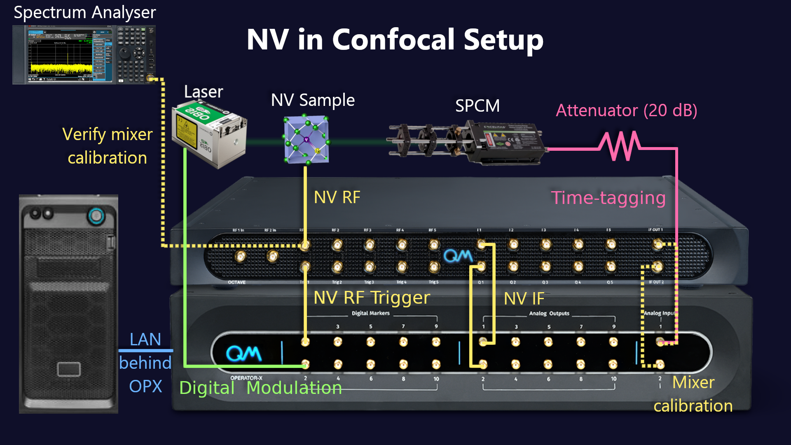

# Single NV center in a confocal setup
## Experimental Setup

## Experiment Protocols
These files showcase various experiments that can be done on an NV center in a confocal setup with an SPCM and a laser,
which is controlled via a digital channel.
These files were tested in a real setup, but are given as-is with no guarantee.
While these can serve as a template for new labs or for new experiments, certain adaptations will probably have to be made.
Use with care.

1. [Hello QUA](01_hello_qua.py) - A script used for playing with QUA
2. [Raw ADC Traces](02_raw_adc_traces.py) - A script used to look at the raw ADC data, this allows checking that the ADC is
not saturated and defining the threshold for time tagging
3. [Counter](03_counter.py) - Starts a counter which reports the current counts from the SPCM
4. [Calibrate Delays](04_calibrate_delays.py) - Plays a MW pulse during a laser pulse, while performing time tagging 
throughout the sequence. This allows measuring all the delays in the system, as well as the NV initialization duration
    * [Calibrate Delays Python Histogram](04_calibrate_delays_python_histogram.py) - This version process the data in 
Python, which makes it slower but works better when the counts are high.
5. [CW ODMR](05_cw_odmr.py) - Counts photons while sweeping the frequency of the applied MW
6. [Time Rabi](06_time_rabi.py) - A Rabi experiment sweeping the duration of the MW pulse
7. [Power Rabi](07_power_rabi.py) - A Rabi experiment sweeping the amplitude of the MW pulse
8. [Ramsey](08_ramsey.py) - Measures T2*
9. [Hahn Echo](09_hahn_echo.py) - Measures T2
10. [T1](10_T1.py) - Measures T1. Can measure the decay from either |1> or |0>
11. [State Tomography](11_state_tomography.py) - Get the state of the qubit by measuring the three projections.
12. [Randomized Benchmarking](12_randomized_benchmarking.py) - Performs a single qubit randomized benchmarking to measure the single qubit gate fidelity for gates longer than 40ns.