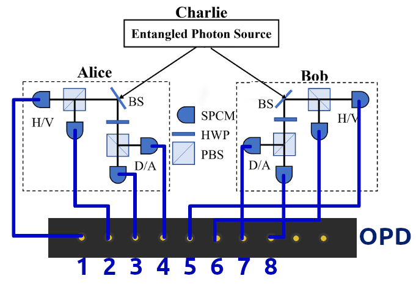
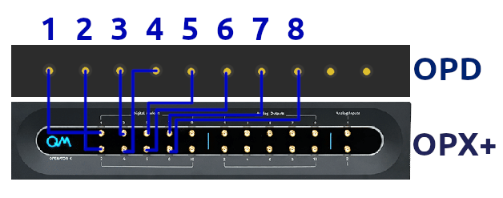

# BBM92 Quantum Key Distribution
## Experimental Setup

### Full Setup

### Test Setup

## Scripts
0. `counting_single_channel.py`: Detect TTL signal counts on a single channel over a given detection window.
1. `counting_live_single_channel.py`: Continuously read and stream photon counts on a single digital input channel.
2. `counting_live_multi_channel.py`: Continuously read and stream photon counts over all digital input channels
3. `timetagging_single_channel.py`: Continuously read and histogram time at which counts were detected in a window.
