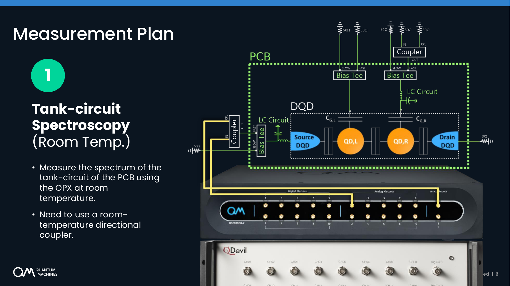
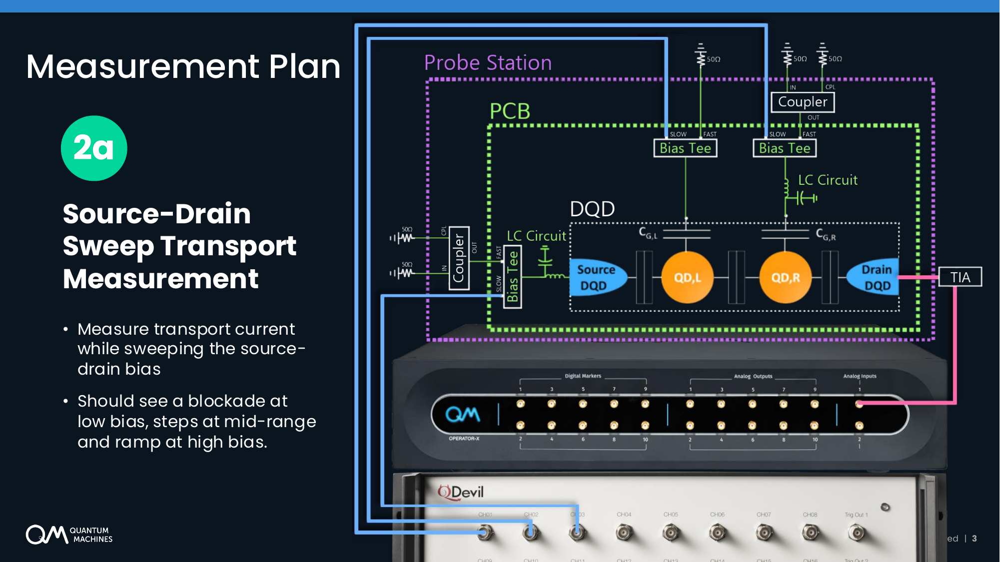
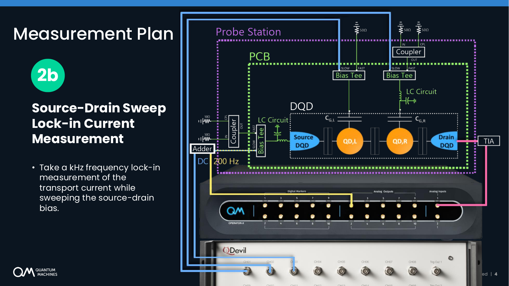
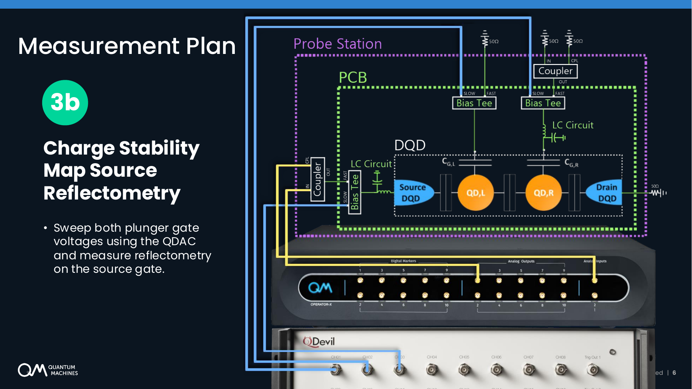
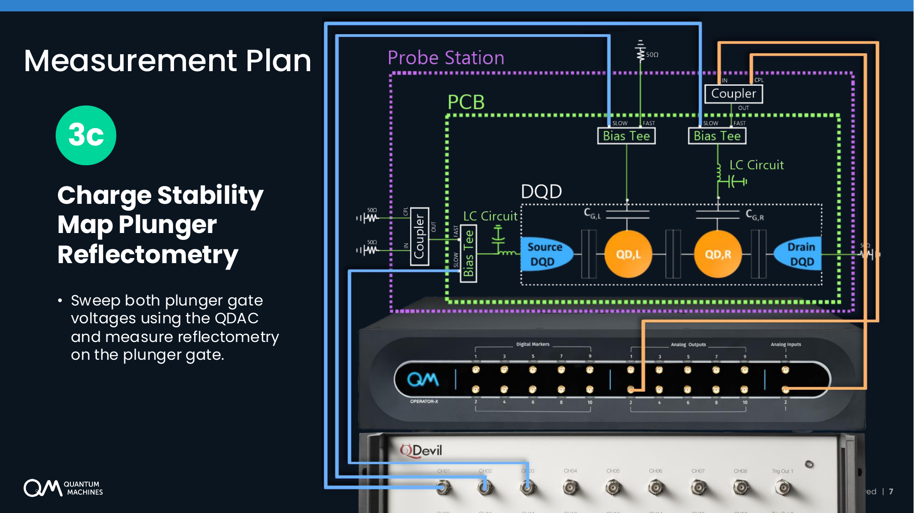
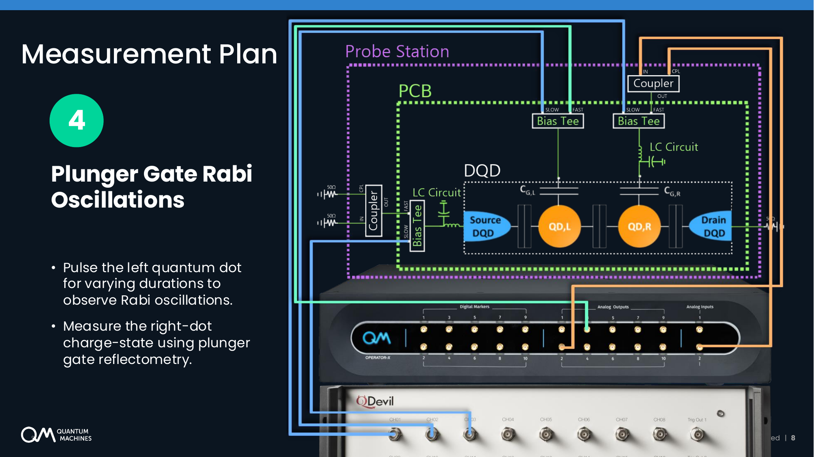

# MOSFET Measaurements and Evaluation
## Requirements
Start by [installing Anaconda 3](https://www.anaconda.com/download) if you have not done so already.

Then, from an Anaconda terminal, run the following commands:
```shell
# Create a conda environment
conda create -n qm python==3.10
conda activate qm

# Install relevant packages
pip install qm-qua, qualang-tools, qcodes_contrib_drivers, pyvisa_py
```
These packages provide access to the following features:
 - **qm-qua**: The QUA SDK required for connecting to and programming the OPX.
 - **qualang-tools**: A library to help with writing QUA programs on the OPX.
 - **qcodes_contrib_drivers**: Contains an open-source driver for connecting to and controlling the QDAC-II.
 - **pysvisa_py**: Library to handle VISA connections to the QDAC-II driver.

## Experiments
### QDAC-II Note
> &#x26a0;&#xfe0f; **When using the QDAC-II** it is best to skip the **first row** and start the wiring from the DC channels on the **second row**.

Therefore, the channels in the diagram need to be shifted to start from **CH09**:
 - **CH09** ↔ Source-Gate
 - **CH10** ↔ Left Plunger-Gate
 - **CH11** ↔ Right Plunger-Gate

### Tank-circuit Spectroscopy
**Purpose**: to verify the functionality of the instrument and components at room temperature.



### Source-Drain Sweep (Transport Measurement)
**Purpose**: to measure the transport current through the source and drain while sweeping a gate voltage.



### Source-Drain Sweep (Lock-in Measurement)
**Purpose**: to measure the transport current through the source and drain while sweeping a gate voltage.



### Charge Stability Map (Source Reflectometry)


### Charge Stability Map (Plunger Reflectometry)


### Plunger Gate Rabi Oscillations

